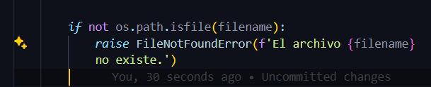

# refactor-practice

A continuación, se procederá a justificar lo implementado para la tarea:


## Refactorización:


### 1. Renombrar método

- Renombramos el método *leerdatos* por *leerdatos_csv*


### 2. Simplificación de condicionales en función *leerdatos_csv*

- Manejamos el caso en el que el archivo .csv no exista




### 3. Extracción de métodos

- Extrajimos el método *es_dni_valido* para mejorar nuestra estructura de código.


### 4. Renombrar variables

- Renombramos la variables *ordenado* por *votos_ordenado*


### 5. División en módulos o archivos:

- Hemos dividido nuestro código en métodos lo suficientemente completos para poder ser validados por separado. 


## Pruebas unitarias

Creamos el archivo *refactor_test.py* para testear cada uno de los métodos de nuestra clase *CalculaGanador*:

Obteniendo que todos estos funcionan y pasan los test case. 


## Evaluación de código resultante
El código cumple con las especificaciones dadas:
- Calcula el ganador de votos validos 
- Lee un dataset compuesto por la cabecera: region,provincia,distrito,dni,candidato,esvalido
- Si hay un candidato con >50% de votos válidos retorna un array con un string con el nombre del ganador
- Si no hay un candidato que cumpla la condicion anterior, retorna un array con los dos candidatos que pasan a segunda vuelta
-  Si ambos empatan con 50% de los votos se retorna el que apareció primero en el archivo
- el DNI debe ser valido (8 digitos)

Nuestro resultado al ejecutar el programa es:

```
['Aundrea Grace']
```


Lo cual indica que ella es la ganadora, con más del 50% de votos válidos.


## Integrantes:

- Virginia Puente
- Mariana Capuñay 